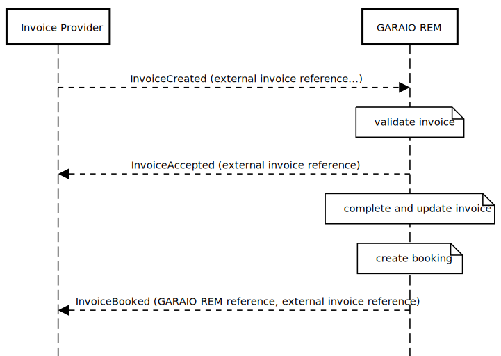
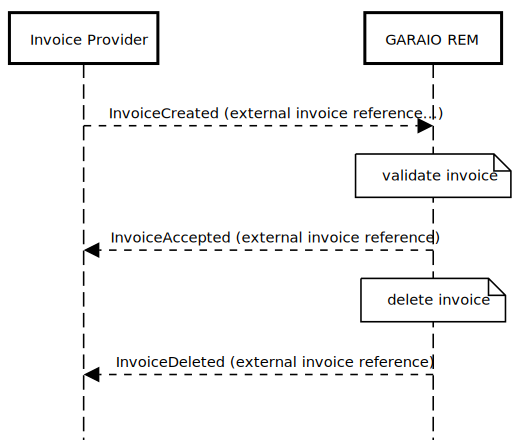

# Orders and Invoicing Context

## Events

Type | GARAIO REM | REM | Description
---|---|---|---
[Invoicing.Order.Created](#invoicingordercreated) | :heavy_check_mark: | :x: | An order has been created
[Invoicing.Order.Accepted](#invoicingorderaccepted) | :heavy_check_mark: | :x: | An order has been accepted by GARAIO REM
[Invoicing.Order.Rejected](#invoicingorderrejected) | :heavy_check_mark: | :x: | An order has been rejected by GARAIO REM
[Invoicing.Invoice.Created](#invoicinginvoicecreated) | :heavy_check_mark: | :x: | An invoice has been created
[Invoicing.Invoice.Accepted](#invoicinginvoiceaccepted) | :heavy_check_mark: | :x: | An invoice has been accepted by GARAIO REM
[Invoicing.Invoice.Rejected](#invoicinginvoicerejected) | :heavy_check_mark: | :x: | An invoice has been rejected by GARAIO REM
[Invoicing.Invoice.Deleted](#invoicinginvoicedeleted) | :heavy_check_mark: | :x: | An incomplete invoice has been deleted in GARAIO REM
[Invoicing.Invoice.Booked](#invoicinginvoicebooked) | :heavy_check_mark: | :x: | An invoice was booked in GARAIO REM
[Invoicing.Invoice.Cancelled](#invoicinginvoicecancelled) | :heavy_check_mark: | :x: | An invoice has been cancelled in GARAIO REM (Storno)
[Invoicing.Invoice.Payed](#invoicinginvoicepayed) | :heavy_check_mark: | :x: | An invoice has been payed by GARAIO REM

### Invoicing.Order.Created

This message goes from the order provider to GARAIO REM. Set  the recipient property in the headers, eg "derham". All attributes are optional unless noted otherwise in the remarks

Field | Type | Content / Remarks
---|---|---
eventType | string | Invoicing.Order.Created
data | hash |
&nbsp;&nbsp;externalReference | string | external identifier from the order provider; GARAIO REM does **not** validate this data, it is just mirrored in reply messages (Accepted / Rejected) **required**
&nbsp;&nbsp;supplierReference | string | reference of the supplier (creditor); **required**
&nbsp;&nbsp;masterdataReference | string | reference of a property / building / unit; **required**
&nbsp;&nbsp;subject | string | Short description of the order
&nbsp;&nbsp;description | string | Description of the order; may contain html
&nbsp;&nbsp;deliveryInfo | string | Free text for the delivery info, eg end of may
&nbsp;&nbsp;discount | decimal | discount (percentage) the supplier is offering for the order
&nbsp;&nbsp;discountDays | integer | number of days for the discount
&nbsp;&nbsp;offeringDate | string | ISO 8601 encoded date, eg '2020-10-21'
&nbsp;&nbsp;amount | decimal | Amount in swiss francs
&nbsp;&nbsp;contactAddress | string | Address lines of the contact person, separated by CRLF
&nbsp;&nbsp;deliveryAddress | string | Address lines for the delivery, separated by CRLF
&nbsp;&nbsp;languageCode | string | de, fr, it or en; will be used to send error reasons using the desired language; **must be lower case**

#### Example

```json
{"eventType":"Invoicing.Order.Created",
  "data":{
    "externalReference":"1234",
    "supplierReference":"5555",
    "subject":"this is the subject",
    "description":"this is the description with some <b>light</b> formatting",
    "deliveryInfo":"end of may",
    "masterdataReference":"4712.01.0001",
    "discount":"5.00",
    "discountDays":"10",
    "offeringDate":"2020-10-13",
    "contactAddress": "Garaio AG\r\nLaupenstrasse 45\r\n3001 Bern",
    "deliveryAddress": "Garaio AG\r\nLaupenstrasse 45\r\n3001 Bern",
    "languageCode":"fr"
  }
}
```

### Invoicing.Order.Accepted

This message goes from GARAIO REM to the order provider and signals that GARAIO REM has stored the order

Field | Type | Content / Remarks
---|---|---
eventType | string | Invoicing.Order.Accepted
data | hash |
&nbsp;&nbsp;reference | longint | unique identifier for the order, generated by GARAIO REM
&nbsp;&nbsp;externalReference | string | unique external identifier from the order provider

#### Example

```json
{"eventType":"Invoicing.Order.Accepted",
  "data":{
    "reference":1234,
    "externalReference":"54820394-001",
  }
}
```

### Invoicing.Order.Rejected

This message goes from GARAIO REM to the order provider and signals that GARAIO REM did not accept the order. GARAIO REM validation errors are mapped into the reasons array

Field | Type | Content / Remarks
---|---|---
eventType | string | Invoicing.Order.Rejected
data | hash |
&nbsp;&nbsp;externalReference | string | unique external identifier from the order provider
&nbsp;&nbsp;reasons | array |
&nbsp;&nbsp;&nbsp;&nbsp;attribute | string | name of the attribute, eg. "masterdataReference"; might be null if the reason does not map to a specific attribute
&nbsp;&nbsp;&nbsp;&nbsp;reason | string | reason, eg. "ist nicht bekannt"

#### Example

```json
{"eventType":"Invoicing.Order.Rejected",
  "data":{
    "externalReference":"1234",
    "reasons":[
      {"attribute":"masterdataReference",
       "reason":"ist nicht bekannt"
      }
    ]
  }
}
```

### Invoicing.Invoice.Created

This message goes from the invoice provider to GARAIO REM. Set  the recipient property in the headers, eg "derham". Depending on the GARAIO REM configuration (AVK strict mode or relaxed mode), invoiceItems are mandatory or not.

Field | Type | Content / Remarks
---|---|---
eventType | string | Invoicing.Invoice.Created
data | hash |
&nbsp;&nbsp;externalReference | string | unique external identifier from the invoice provider; **required**
&nbsp;&nbsp;orderReference | longint | optional reference of the associated order; must be an order reference generated by GARAIO REM; leave it empty if you pass an externalOrderReference
&nbsp;&nbsp;externalOrderReference | string | optional external reference of the associated order generated by the orders provider
&nbsp;&nbsp;creditorReference | string | reference of the creditor (supplier); **required**
&nbsp;&nbsp;accountingReference | string | reference of the accounting; **required**
&nbsp;&nbsp;iban | string | iban for the payment (optional); always pass the iban or swissQrCodeText, if you pass the iban field esr attributes and swissQrCodeText must be empty or omitted
&nbsp;&nbsp;esrReference | string | reference number on the payment slip. Pass this number together with the esrParticipantNumber if you don't have an iban or swissQrCodeText
&nbsp;&nbsp;esrParticipantNumber | string | pass this number together with the esrReference if you don't have an iban or swissQrCodeText
&nbsp;&nbsp;languageCode | string | de, fr, it or en; **required** to send error reasons using the desired language; **must be lower case**
&nbsp;&nbsp;notes | string | up to four lines of text at up to 28 chars per line, separated by CRLF (optional)
&nbsp;&nbsp;documentUrl | string | url to the invoice pdf; **must be an url to a pdf that the local browser can resolve**
&nbsp;&nbsp;totalGrossAmount | decimal | total gross amount of the invoice; **required if no invoiceItems are supplied**, must be greater than 0
&nbsp;&nbsp;externalUserName | string | optional name of the user that completed the invoice in the external process
&nbsp;&nbsp;dmsReference | string | optional reference of the DMS document
&nbsp;&nbsp;invoiceDate | string | ISO 8601 encoded date, eg '2020-10-21'; **required**
&nbsp;&nbsp;dueDate | string | ISO 8601 encoded date, eg '2020-10-21'; optional, defaults to today
&nbsp;&nbsp;bookingDate | string | ISO 8601 encoded date, eg '2020-10-21'; optional, defaults to today
&nbsp;&nbsp;transitoryDeferralPeriod | string | optional, ISO 8601 Time-Interval, WE ONLY SUPPORT THE START/END format using ISO 8601 encoded dates (no TIME inclusion is supported) using the separator '/' or '--', eg '2020-01-31/2020-06-30' or '2020-01-31--2020-06-30' (<https://en.wikipedia.org/wiki/ISO_8601#Time_intervals>); **NOTE: this field may NOT be used with 'transitoryDeferralDates' within 'invoiceItems'**
&nbsp;&nbsp;swissQrCode | hash | swissQrCode; **optional** (when used:  IBAN & ESR fields MUST BE EMPTY or Omitted!); see the SwissQRCode section for Garaio-REM usage -- the full swissQrCode Specification is found at: https://www.paymentstandards.ch/dam/downloads/ig-qr-bill-en.pdf
&nbsp;&nbsp;invoiceItems | array | if AVK is configured for strict mode, at least one item is required; if strict mode is disabled, you may pass an empty array, null or omit the attribute
&nbsp;&nbsp;&nbsp;&nbsp;itemNumber | integer | invoice item number to preserve order; **required**
&nbsp;&nbsp;&nbsp;&nbsp;accountNumber | string | accounting account number, prefixed by the accounting reference, eg "6056.10122"; **required**
&nbsp;&nbsp;&nbsp;&nbsp;costCenterNumber | string | cost center number; optional / required depending on the accountNumber
&nbsp;&nbsp;&nbsp;&nbsp;taxCode | string | tax code known to GARAIO REM, eg 'NO'; optional / required depending on the accountNumber
&nbsp;&nbsp;&nbsp;&nbsp;bookingAmount | decimal | amount to book (including taxes, if appropriate); **required**
&nbsp;&nbsp;&nbsp;&nbsp;bookingText | string | optional booking text
&nbsp;&nbsp;&nbsp;&nbsp;masterdataReference | string | optional reference of a property / building / unit; might be required depending on the accountNumber
&nbsp;&nbsp;&nbsp;&nbsp;additionalCostsDate | string | ISO 8601 encoded date, eg '2021-06-30' (NK-Periodedatum); optional or required depending on the accountNumber
&nbsp;&nbsp;&nbsp;&nbsp;valueDate | string | ISO 8601 encoded date, eg '2020-10-21' (Valuta); optional, defaults to today
&nbsp;&nbsp;&nbsp;&nbsp;amount | decimal | Quantity - optional / required depending on the accountNumber, eg. litres of oil
&nbsp;&nbsp;&nbsp;&nbsp;transitoryDeferralDate | string | optional ISO 8601 encoded date, eg '2020-10-21', optional (transitorisches Abgrenzungsdatum)
&nbsp;&nbsp;&nbsp;&nbsp;maintenanceLogText | string | optional uses bookingText if empty

#### Example of a complete invoice with IBAN

```json
{"eventType":"Invoicing.Invoice.Created",
  "data":{
    "externalReference":"1234",
    "externalOrderReference":"5678",
    "creditorReference":"5555",
    "accountingReference":"4711",
    "iban":"CH0209000000100013997",
    "languageCode":"fr",
    "notes":"line 1\r\nline 2\r\nline 3\r\nline 4",
    "documentUrl":"https://path/to/the/scan.pdf",
    "totalGrossAmount":1200.50,
    "externalUserName":"External User",
    "dmsReference":"5678",
    "invoiceDate":"2020-10-21",
    "dueDate":"2020-11-21",
    "bookingDate":"2020-10-21",
    "invoiceItems":[
      {"lineNumber":1,
       "accountNumber":"4712.100001",
       "costCenterNumber":"700",
       "taxCode":"00",
       "bookingAmount":1200.50,
       "bookingText":"this goes into the booking movement",
       "masterdataReference":"4712.01",
       "additionalCostsDate":"2021-06-30",
       "valueDate":"2020-10-21",
       "amount":100.00,
       "transitoryDeferralDate":"2020-12-31",
      }
    ]
  }
}
```

#### Example of a minimal invoice (relaxed mode)

```json
{"eventType":"Invoicing.Invoice.Created",
  "data":{
    "externalReference":"1234",
    "creditorReference":"5555",
    "accountingReference":"4711",
    "totalGrossAmount":1200.50
  }
}
```

#### Swiss QR Code Usage Documentation - with an example

This documentation is primarily concerned with formatting the Swiss QR Code into a valid Garaio REM input.  For full Swiss QR Code usage details please see: https://www.paymentstandards.ch/dam/downloads/ig-qr-bill-en.pdf

GaraioREM Variable | SwissQRCode Data Group | SwissQRCode Input Name | GARAIO REM Type | Description
---|---|---|---|---
swissQrCode { | | | hash | swissQrCode (when used IBAN & ESR fields MUST BE EMPTY or Omitted); **optional**
&nbsp; | header { | | hash | Header information; **required data group**
&nbsp; | &nbsp; | qrType | string | QR-Type - Fixed value (must be 'SPC' for "Swiss Payments Code"); **required**
&nbsp; | &nbsp; | version | string | Version - fixed length: 4 (numeric) (we support '0200'); **required**
&nbsp; | &nbsp; | coding | integer | Coding Type - fixed length: 4 (numeric); **required** (we support '1')
&nbsp; | } | |  |
&nbsp; | cdtrInf { |  | hash | Creditor Account Infomation; **required data group**
&nbsp; | &nbsp; | iban | string | fixed length:21 alphanumeric characters (only CH & LI - country codes are allowed); **required**
&nbsp; | } | |  |
&nbsp; | cdtr { | | hash | Creditor Infomation; **required data group**
&nbsp; | &nbsp; | adrTp | string | fixed length: 1 (must be either 'S' _a **structured address_ or 'K' _2 line combined address_); **required**
&nbsp; | &nbsp; | name | string | Name or Company-Name (maximum 70 characters); **required**
&nbsp; | &nbsp; | strtNmOrAdrLine1 | string | Street Address 1 (maximum 70 characters); **dependent on address type**
&nbsp; | &nbsp; | bldgNbOrAdrLine2 | string | House number oder Address Line 2 (maximum 16 or 70 characters); **dependent on address type**
&nbsp; | &nbsp; | pstCd | string | Postal Code (maximum 16 characters); **dependent on address type**
&nbsp; | &nbsp; | twnNm | string | Town name (Maximal 35 Zeichen zulässig); **dependent on address type**
&nbsp; | &nbsp; | ctry | string | Country (2 letter country codes using: ISO 3166-1); **required**
&nbsp; | } | |  |
&nbsp; | ultmtCdtr { |  | hash | Ultimate Creditor Recipient; **optional data group**
&nbsp; | &nbsp; | adrTp | string | Address-Type; **optional**
&nbsp; | &nbsp; | name | string | Name; **optional**
&nbsp; | &nbsp; | strtNmOrAdrLine1 | string | Street or  Address Line 1; **optional**
&nbsp; | &nbsp; | bldgNbOrAdrLine2 | string | House number or Address Line 2; **optional**
&nbsp; | &nbsp; | pstCd | string | Postal Code; **optional**
&nbsp; | &nbsp; | twnNm | string | Town name; **optional**
&nbsp; | &nbsp; | ctry | string | Country (2-stelliger Landescode gemäss ISO 3166-1); **optional**
&nbsp; | } | |  |
&nbsp; | ccyAmt { | | hash | Payment Information; **required data group**
&nbsp; | &nbsp; | amt | decimal | Payment Amount (maximum 12 characters allowed, including the decimal point); **required**
&nbsp; | &nbsp; | ccy | string | Currency (valid entries are: 'CHF' and 'EUR'); **required**
&nbsp; | ultmtDbtr { | | hash | Ultimate Debitor Recipient; **optional data group**
&nbsp; | &nbsp; | adrTp | string | fixed length - (must be either 'S' _a structured address_ or 'K' _2 lined combined address_); **required if using this data group**
&nbsp; | &nbsp; | name | string | Name or Company-Name (maximum 70 characters); **required when using this data group**
&nbsp; | &nbsp; | strtNmOrAdrLine1 | string | Street Address 1 (maximum 70 characters); **optional**
&nbsp; | &nbsp; | bldgNbOrAdrLine2 | string | House number oder Address Line 2; **depends on address-type**
&nbsp; | &nbsp; | pstCd | string | Postal Code (maximum 16 characters); **depends on address-type**
&nbsp; | &nbsp; | twnNm | string | Town name (Maximal 35 Zeichen zulässig); **depends on address-type**
&nbsp; | &nbsp; | ctry | string | Country (2 letter country codes using: ISO 3166-1); **required when using this data group**
&nbsp; | rmtInf { | | hash | Payment Reference Information; **required data group**
&nbsp; | &nbsp; | tp | string | Rerference Type (maximum 4 characters valid options are: QRR (qr-referenc), SCOR (creditor-reference ISO 11649), NON (no reference)); **required**
&nbsp; | &nbsp; | ref | string | Reference string; **required for QRR or SCOR types**
&nbsp; | } | |  |
&nbsp; | addInf { | | hash | Additional Information; **required data group**
&nbsp; | &nbsp; | ustrd | string | Unstructured Information (maximum 140); **Optional**
&nbsp; | &nbsp; | trailer | string | Trailer (fixed length: 3 characters, only option is 'EPD' _end of payment data_); **required**
&nbsp; | &nbsp; | strdBkgInf | string | Automatic Booking Informationen (maxium 140 characters); **Optional**
&nbsp; | } | |  |
&nbsp; | altPmtInf [ | | Array | Alternative Process; **Optional** (maximum 2 altPmt values allowed)
&nbsp; | &nbsp; | altPmt | string | Alternative Process Parameters (maximum 100 characters); **required when using this data group**
&nbsp; | ] | |  |
} | | |  |


```json
{"eventType":"Invoicing.Invoice.Created",
  "data":{
    "externalReference":"1234",
    "creditorReference":"100010",
    "accountingReference":"1",
    "invoiceDate":"2020-10-21",
    "dueDate":"2020-11-21",
    "bookingDate":"2020-10-21",
    "languageCode":"de",
    "notes":"zeile 1",
    "documentUrl":"https://path/to/the/scan.pdf",
    "invoiceItems":[
      { "lineNumber":1,
        "accountNumber":"1.400000",
        "bookingAmount":1200.5,
        "bookingText":"this goes into the booking movement"
      }
    ],
    "swissQrCode":{
      "header":{
        "qrType":"SPC",
        "version":"0200",
        "coding":"1"
      },
      "cdtrInf":{
        "iban":"CH4431999123000889012"
      },
      "cdtr":{
        "adrTp":"S",
        "name":"Robert Schneider AG",
        "strtNmOrAdrLine1":"Rue du Lac",
        "bldgNbOrAdrLine2":"1268",
        "pstCd":"2501",
        "twnNm":"Biel",
        "ctry":"CH"
      },
      "ultmtCdtr":{
        "adrTp":"S",
        "name":"ultm_kred_name",
        "strtNmOrAdrLine1":"ultm_kred_adresse1_oder_strasse",
        "bldgNbOrAdrLine2":"ultm_kred_adresse2_oder_hausnr",
        "pstCd":"ultm_kred_plz",
        "twnNm":"ultm_kred_ort",
        "ctry":"ultm_kred_land"
      },
      "ccyAmt":{
        "amt":"12949.75",
        "ccy":"CHF"
      },
      "ultmtDbtr":{
        "adrTp":"K",
        "name":"Pia-Maria Rutschmann-Schnyder",
        "strtNmOrAdrLine1":"Grosse Marktgasse 28",
        "bldgNbOrAdrLine2":"9400 Rorschach",
        "ctry":"CH"
      },
      "rmtInf":{
        "tp":"QRR",
        "ref":"210000000003139471430009017"
      },
      "addInf":{
        "ustrd":"Auftrag vom 15.06.2020",
        "trailer":"EPD",
        "strdBkgInf":"//S1/01/20170309/11/10201409/20/14000000/22"
      },
      "altPmtInf":[
        "Name AV1: UV;UltraPay005;12345",
        "eBill/B/41010560425610173"
      ]
    }
  }
}
```
### Invoicing.Invoice.Accepted

This message goes from GARAIO REM to the invoice provider and signals that GARAIO REM has stored and booked the invoice

Field | Type | Content / Remarks
---|---|---
eventType | string | Invoicing.Invoice.Accepted
data | hash |
&nbsp;&nbsp;externalReference | string | unique external identifier from the invoice provider

#### Example

```json
{"eventType":"Invoicing.Invoice.Accepted",
  "data":{
    "externalReference":"54820394-001",
  }
}
```

### Invoicing.Invoice.Rejected

This message goes from GARAIO REM to the invoice provider and signals that GARAIO REM did not accept the invoice. GARAIO REM validation errors are mapped into the reasons array

Field | Type | Content / Remarks
---|---|---
eventType | string | Invoicing.Invoice.Rejected
data | hash |
&nbsp;&nbsp;externalReference | string | unique external identifier from the invoice provider
&nbsp;&nbsp;reasons | array |
&nbsp;&nbsp;&nbsp;&nbsp;attribute | string | name of the attribute, eg. "accountingReference"; might be null if the reason does not map to a specific attribute
&nbsp;&nbsp;&nbsp;&nbsp;lineNumber | integer | Invoice line number if the problem is on an invoice line or null, if not
&nbsp;&nbsp;&nbsp;&nbsp;reason | string | reason, eg. "ist nicht bekannt"

#### Example

```json
{"eventType":"Invoicing.Invoice.Rejected",
  "data":{
    "externalReference":"1234",
    "reasons":[
      {"attribute":"accountingReference",
       "lineNumber":null,
       "reason":"ist nicht bekannt"
      }
    ]
  }
}
```

### Invoicing.Invoice.Deleted

This message goes from GARAIO REM to the invoice provider and signals that a user has deleted the incomplete (not yet booked) invoice in GARAIO REM

Field | Type | Content / Remarks
---|---|---
eventType | string | Invoicing.Invoice.Deleted
data | hash |
&nbsp;&nbsp;externalReference | string | unique external identifier from the invoice provider

#### Example

```json
{"eventType":"Invoicing.Invoice.Deleted",
  "data":{
    "externalReference":"54820394-001",
  }
}
```

### Invoicing.Invoice.Booked

This message goes from GARAIO REM to the invoice provider and signals that GARAIO REM has booked the invoice. This may happen immediately after receiving a Invoicing.Invoice.Created message (if the invoice data is valid and complete) or it may happen after a user has completed an incomplete invoice.

In any case, this message follows a Invoicing.Invoice.Accepted message, immediately or later (in case of an invoice that needs user interaction)

Field | Type | Content / Remarks
---|---|---
eventType | string | Invoicing.Invoice.Booked
data | hash |
&nbsp;&nbsp;reference | longint | unique identifier for the invoice, generated by GARAIO REM
&nbsp;&nbsp;externalReference | string | unique external identifier from the invoice provider

#### Example

```json
{"eventType":"Invoicing.Invoice.Booked",
  "data":{
    "reference":1234,
    "externalReference":"54820394-001",
  }
}
```

### Invoicing.Invoice.Cancelled

This message goes from GARAIO REM to the invoice provider and signals that a user has cancelled the booked invoice in GARAIO REM (Storno)

Field | Type | Content / Remarks
---|---|---
eventType | string | Invoicing.Invoice.Cancelled
data | hash |
&nbsp;&nbsp;externalReference | string | unique external identifier from the invoice provider

#### Example

```json
{"eventType":"Invoicing.Invoice.Cancelled",
  "data":{
    "externalReference":"54820394-001",
  }
}
```

### Invoicing.Invoice.Payed

This message goes from GARAIO REM to the invoice provider and signals that GARAIO REM has payed the invoice

Field | Type | Content / Remarks
---|---|---
eventType | string | Invoicing.Invoice.Payed
data | hash |
&nbsp;&nbsp;externalReference | string | unique external identifier from the invoice provider
&nbsp;&nbsp;paymentDate | date | Date when the payment was triggered in GARAIO REM

#### Example

```json
{"eventType":"Invoicing.Invoice.Payed",
  "data":{
    "externalReference":"54820394-001",
    "paymentDate":"2021-03-10"
  }
}
```

## Message Flows

### Invoice submission happy path

GARAIO REM receives an invoice that passes all validations, stores the invoice, creates the booking and sends the InvoiceAccepted message back to the invoice provider with the external invoice reference


### Invoice validation errors

GARAIO REM receives an invoice that does not pass the validations, does NOT store the invoice and sends the InvoiceRejected message back to the invoice provider with the external invoice reference and the reasons (validation errors)


### Incomplete invoice

GARAIO REM receives an incomplete invoice that passes the basic validations but is not complete, stores the invoice, does NOT create the booking and sends the InvoiceAccepted message back to the invoice provider with the external invoice reference

Later, a user completes the invoice, GARAIO REM creates the booking and sends the InvoiceBooked message back to the invoice provider with the internal GARAIO REM reference and the external invoice reference



### Invoice deleted

GARAIO REM receives an invoice that passes the basic validations but needs completion, stores the invoice and sends the InvoiceAccepted message back to the invoice provider with the external invoice reference

Later, a user deletes the invoice and GARAIO REM sends the InvoiceDeleted message back to the invoice provider with the external invoice reference



### Invoice cancelled

GARAIO REM receives an invoice that passes the validations, stores the invoice, creates the booking and sends the InvoiceAccepted message back to the invoice provider with the external invoice reference

Later, a user cancels the invoice and GARAIO REM sends the InvoiceCancelled message back to the invoice provider with the external invoice reference


### Invoice payed

GARAIO REM receives an invoice that passes the validations, stores the invoice, creates the booking and sends the InvoiceAccepted message back to the invoice provider with the external invoice reference

Later, GARAIO REM pays the invoice and GARAIO REM sends the InvoicePayed message back to the invoice provider with the external invoice reference


### Order and invoice message flow with incomplete invoices

GARAIO REM receives an order and stores the order.

Later, The invoice provider finds the order through a GraphQL query and sends an InvoiceCreated message to GARAIO REM including the order number. GARAIO REM validates the invoice data, stores the invoice, links it to the order and sends an InvoiceAccepted message to the invoice provider.

Later, a user completes the invoice in GARAIO REM and the invoice is booked.

Later, GARAIO REM pays the invoice and GARAIO REM sends the InvoicePayed message back to the invoice provider with the external invoice reference


