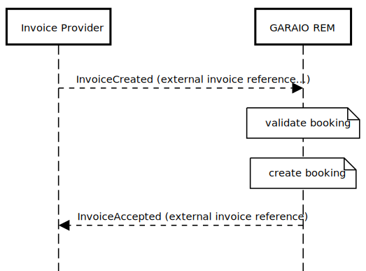
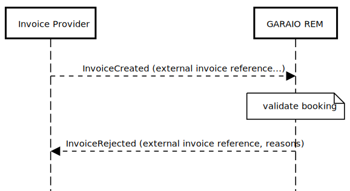
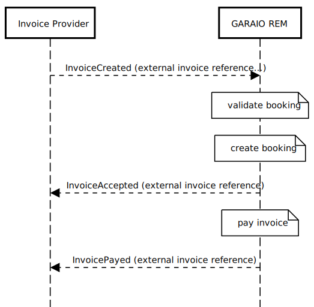
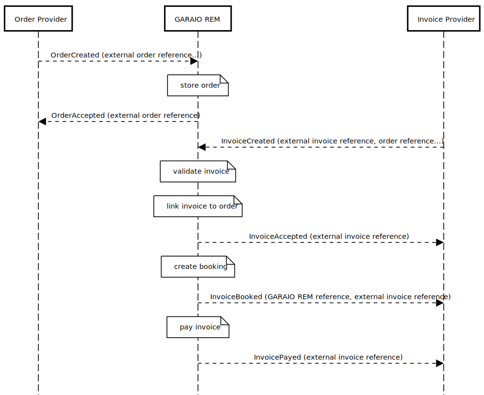

# Orders and Invoicing Context

## Events

Type | Status | Description
---|---|---
[Invoicing.Order.Created](#invoicingordercreated) | Draft | An order has been created
[Invoicing.Order.Accepted](#invoicingorderaccepted) | Draft | An order has been accepted by GARAIO REM
[Invoicing.Order.Rejected](#invoicingorderrejected) | Draft | An order has been rejected by GARAIO REM
[Invoicing.Invoice.Created](#invoicinginvoicecreated) | Draft | An invoice has been created
[Invoicing.Invoice.Accepted](#invoicinginvoiceaccepted) | Draft | An invoice has been accepted by GARAIO REM
[Invoicing.Invoice.Rejected](#invoicinginvoicerejected) | Draft | An invoice has been rejected by GARAIO REM
[Invoicing.Invoice.Cancelled](#invoicinginvoicecancelled) | Draft | An invoice has been cancelled in GARAIO REM
[Invoicing.Invoice.Payed](#invoicinginvoicepayed) | Draft | An invoice has been payed by GARAIO REM

### Invoicing.Order.Created

This message goes from the order provider to GARAIO REM. Set  the recipient property in the headers, eg "derham". All attributes are optional unless noted otherwise in the remarks

Field | Type | Content / Remarks
---|---|---
eventType | string | Invoicing.Order.Created
data | hash |
&nbsp;&nbsp;externalReference | string | unique external identifier from the order provider; **required**
&nbsp;&nbsp;supplierReference | string | reference of the supplier (creditor); **required**
&nbsp;&nbsp;masterdataReference | string | reference of a property / building / unit; **required**
&nbsp;&nbsp;subject | string | Short description of the order
&nbsp;&nbsp;description | string | Description of the order; may contain html
&nbsp;&nbsp;dateOfDelivery | string | ISO 8601 encoded date, eg '2020-10-21'
&nbsp;&nbsp;discount | decimal | discount (percentage) the supplier is offering for the order
&nbsp;&nbsp;discountDays | integer | number of days for the discount
&nbsp;&nbsp;offeringDate | string | ISO 8601 encoded date, eg '2020-10-21'
&nbsp;&nbsp;amount | decimal | Amount in swiss francs
&nbsp;&nbsp;contactAddress | string | Address lines of the contact person
&nbsp;&nbsp;deliveryAddress | string | Address lines for the delivery
&nbsp;&nbsp;languageCode | string | de, fr, it or en; will be used to send error reasons using the desired language

#### Example

```json
{"eventType":"Invoicing.Order.Created",
  "data":{
    "externalReference":"1234",
    "supplierReference":"5555",
    "subject":"this is the subject",
    "description":"this is the description with some <b>light</b> formatting",
    "dateOfDelivery":"2020-10-21",
    "masterdataReference":"4712.01.0001",
    "discount":"5.00",
    "discountDays":"10",
    "offeringDate":"2020-10-13",
    "contactAddress": "Garaio AG\\nLaupenstrasse 45\\n3001 Bern",
    "deliveryAddress": "Garaio AG\\nLaupenstrasse 45\\n3001 Bern",
    "languageCode":"fr"
  }
}
```

### Invoicing.Order.Accepted

This message goes from GARAIO REM to the order provider and signals that GARAIO REM has stored the order

Field | Type | Content / Remarks
---|---|---
eventType | string | Invoicing.Order.Accepted
data | hash |
&nbsp;&nbsp;reference | longint | unique identifier for the order, generated by GARAIO REM
&nbsp;&nbsp;externalReference | string | unique external identifier from the order provider

#### Example

```json
{"eventType":"Invoicing.Order.Accepted",
  "data":{
    "reference":1234,
    "externalReference":"54820394-001",
  }
}
```

### Invoicing.Order.Rejected

This message goes from GARAIO REM to the order provider and signals that GARAIO REM did not accept the order. GARAIO REM validation errors are mapped into the reasons array

Field | Type | Content / Remarks
---|---|---
eventType | string | Invoicing.Order.Rejected
data | hash |
&nbsp;&nbsp;externalReference | string | unique external identifier from the order provider
&nbsp;&nbsp;reasons | array |
&nbsp;&nbsp;&nbsp;&nbsp;attribute | string | name of the attribute, eg. "masterdataReference"; might be null if the reason does not map to a specific attribute
&nbsp;&nbsp;&nbsp;&nbsp;reason | string | reason, eg. "ist nicht bekannt"

#### Example

```json
{"eventType":"Invoicing.Order.Rejected",
  "data":{
    "externalReference":"1234",
    "reasons":[
      {"attribute":"masterdataReference",
       "reason":"ist nicht bekannt"
      }
    ]
  }
}
```

### Invoicing.Invoice.Created

This message goes from the invoice provider to GARAIO REM. Set  the recipient property in the headers, eg "derham". All attributes are mandatory unless noted otherwise in the remarks

Field | Type | Content / Remarks
---|---|---
eventType | string | Invoicing.Invoice.Created
data | hash |
&nbsp;&nbsp;externalReference | string | unique external identifier from the invoice provider
&nbsp;&nbsp;orderReference | string | optional reference of the associated order
&nbsp;&nbsp;creditorReference | string | reference of the creditor (supplier)
&nbsp;&nbsp;accountingReference | string | reference of the accounting
&nbsp;&nbsp;iban | string | iban for the payment (optional); lways pass the iban if you know it and leave the esr attributes empty
&nbsp;&nbsp;esrReference | string | reference number on the payment slip. Pass this number together with the esrParticipantNumber if you don't have an iban
&nbsp;&nbsp;esrParticipantNumber | string | pass this number together with the esrReference if you don't have an iban
&nbsp;&nbsp;invoiceDate | string | ISO 8601 encoded date, eg '2020-10-21'; optional, defaults to today
&nbsp;&nbsp;dueDate | string | ISO 8601 encoded date, eg '2020-10-21'; optional, defaults to today
&nbsp;&nbsp;bookingDate | string | ISO 8601 encoded date, eg '2020-10-21'; optional, defaults to today
&nbsp;&nbsp;languageCode | string | de, fr, it or en; will be used to send error reasons using the desired language
&nbsp;&nbsp;notes | string | notes for the invoice (optional)
&nbsp;&nbsp;documentUrl | string | url to the invoice PDF
&nbsp;&nbsp;invoiceItems | array | at least one item is required
&nbsp;&nbsp;&nbsp;&nbsp;itemNumber | integer | invoice item number to preserve order
&nbsp;&nbsp;&nbsp;&nbsp;accountNumber | string | accounting account number, prefixed by the accounting reference, eg "6056.10122"
&nbsp;&nbsp;&nbsp;&nbsp;costCenterNumber | string | cost center number; optional / required depending on the accountNumber
&nbsp;&nbsp;&nbsp;&nbsp;taxCode | string | tax code known to GARAIO REM, eg 'NO'; optional / required depending on the accountNumber
&nbsp;&nbsp;&nbsp;&nbsp;bookingAmount | decimal | amount to book (including taxes, if appropriate)
&nbsp;&nbsp;&nbsp;&nbsp;bookingText | string | optional booking text
&nbsp;&nbsp;&nbsp;&nbsp;masterdataReference | string | optional reference of a property / building / unit; might be required depending on the accountNumber
&nbsp;&nbsp;&nbsp;&nbsp;additionalCostsDate | string | ISO 8601 encoded date, eg '2021-06-30' (NK-Periodedatum); optional or required depending on the accountNumber
&nbsp;&nbsp;&nbsp;&nbsp;valueDate | string | ISO 8601 encoded date, eg '2020-10-21' (Valuta); optional, defaults to today
&nbsp;&nbsp;&nbsp;&nbsp;amount | decimal | optional / required depending on the accountNumber, eg. litres of oil
&nbsp;&nbsp;&nbsp;&nbsp;transitoryDeferralDate | string | optional ISO 8601 encoded date, eg '2020-10-21', optional (transitorisches Abgrenzungsdatum)

#### Example

```json
{"eventType":"Invoicing.Invoice.Created",
  "data":{
    "externalReference":"1234",
    "orderReference":"5678",
    "creditorReference":"5555",
    "accountingReference":"4711",
    "iban":"CH0209000000100013997",
    "invoiceDate":"2020-10-21",
    "dueDate":"2020-11-21",
    "bookingDate":"2020-10-21",
    "languageCode":"fr",
    "notes":"some infos concerning the invoice",
    "documentUrl":"https://path/to/the/scan.pdf",
    "invoiceItems":[
      {"lineNumber":1,
       "accountNumber":"4712.100001",
       "costCenterNumber":"700",
       "taxCode":"00",
       "bookingAmount":1200.50,
       "bookingText":"this goes into the booking movement",
       "masterdataReference":"4712.01",
       "additionalCostsDate":"2021-06-30",
       "valueDate":"2020-10-21",
       "amount":100.00,
       "transitoryDeferralDate":"2020-12-31",
      }
    ]
  }
}
```

### Invoicing.Invoice.Accepted

This message goes from GARAIO REM to the invoice provider and signals that GARAIO REM has stored and booked the invoice

Field | Type | Content / Remarks
---|---|---
eventType | string | Invoicing.Invoice.Accepted
data | hash |
&nbsp;&nbsp;reference | longint | unique identifier for the invoice, generated by GARAIO REM
&nbsp;&nbsp;externalReference | string | unique external identifier from the invoice provider

#### Example

```json
{"eventType":"Invoicing.Invoice.Accepted",
  "data":{
    "reference":1234,
    "externalReference":"54820394-001",
  }
}
```

### Invoicing.Invoice.Rejected

This message goes from GARAIO REM to the invoice provider and signals that GARAIO REM did not accept the invoice. GARAIO REM validation errors are mapped into the reasons array

Field | Type | Content / Remarks
---|---|---
eventType | string | Invoicing.Invoice.Rejected
data | hash |
&nbsp;&nbsp;externalReference | string | unique external identifier from the invoice provider
&nbsp;&nbsp;reasons | array |
&nbsp;&nbsp;&nbsp;&nbsp;attribute | string | name of the attribute, eg. "accountingReference"; might be null if the reason does not map to a specific attribute
&nbsp;&nbsp;&nbsp;&nbsp;lineNumber | integer | Invoice line number if the problem is on an invoice line or null, if not
&nbsp;&nbsp;&nbsp;&nbsp;reason | string | reason, eg. "ist nicht bekannt"

#### Example

```json
{"eventType":"Invoicing.Invoice.Rejected",
  "data":{
    "externalReference":"1234",
    "reasons":[
      {"attribute":"accountingReference",
       "lineNumber":null,
       "reason":"ist nicht bekannt"
      }
    ]
  }
}
```

### Invoicing.Invoice.Cancelled

This message goes from GARAIO REM to the invoice provider and signals that a user has cancelled the invoice in GARAIO REM

Field | Type | Content / Remarks
---|---|---
eventType | string | Invoicing.Invoice.Cancelled
data | hash |
&nbsp;&nbsp;externalReference | string | unique external identifier from the invoice provider

#### Example

```json
{"eventType":"Invoicing.Invoice.Cancelled",
  "data":{
    "externalReference":"54820394-001",
  }
}
```

### Invoicing.Invoice.Payed

This message goes from GARAIO REM to the invoice provider and signals that GARAIO REM has payed the invoice

Field | Type | Content / Remarks
---|---|---
eventType | string | Invoicing.Invoice.Payed
data | hash |
&nbsp;&nbsp;externalReference | string | unique external identifier from the invoice provider

#### Example

```json
{"eventType":"Invoicing.Invoice.Payed",
  "data":{
    "externalReference":"54820394-001",
  }
}
```

## Message Flows

### Invoice submission happy path

GARAIO REM receives an invoice that passes the validations, stores the invoice, creates the booking and sends the InvoiceAccepted message back to the invoice provider with the external invoice reference



### Invoice validation errors

GARAIO REM receives an invoice that does not pass the validations, does NOT store the invoice and sends the InvoiceRejected message back to the invoice provider with the external invoice reference and the reasons (validation errors)



### Invoice cancelled

GARAIO REM receives an invoice that passes the validations, stores the invoice, creates the booking and sends the InvoiceAccepted message back to the invoice provider with the external invoice reference

Later, a user cancels the invoice and GARAIO REM sends the InvoiceCancelled message back to the invoice provider with the external invoice reference


### Invoice payed

GARAIO REM receives an invoice that passes the validations, stores the invoice, creates the booking and sends the InvoiceAccepted message back to the invoice provider with the external invoice reference

Later, GARAIO REM pays the invoice and GARAIO REM sends the InvoicePayed message back to the invoice provider with the external invoice reference



### Order and invoice message flow with incomplete invoices

GARAIO REM receives an order and stores the order.

Later, The invoice provider finds the order through a GaphQL query and sends an InvoiceCreated message to GARAIO REM including the order number. GARAIO REM validates the invoice data, stores the invoice, links it to the order and sends an InvoiceAccepted message to the invoice provider and the order provider.

Later, a user completes the invoice in GARAIO REM, the invoice is booked and and GARAIO REM sends the InvoiceBooked message back to the invoice provider.

Later, GARAIO REM pays the invoice and GARAIO REM sends the InvoicePayed message back to the invoice provider with the external invoice reference


